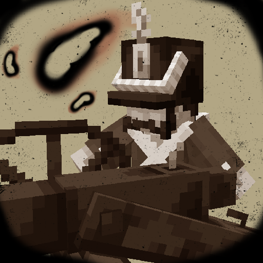

<!-- ` -->
<h1> Coats and Valour</h1>

An ‘authentic’ revolutionary warfare experience in Minecraft.

# Dependencies
- Fabric API (required)
- AzureLib (required for animations)
- SmartBrainLib (required for ???) (unimplemented) `//TODO`
- EMI (optional/required??? for ???) (unimplemented) `//TODO`
